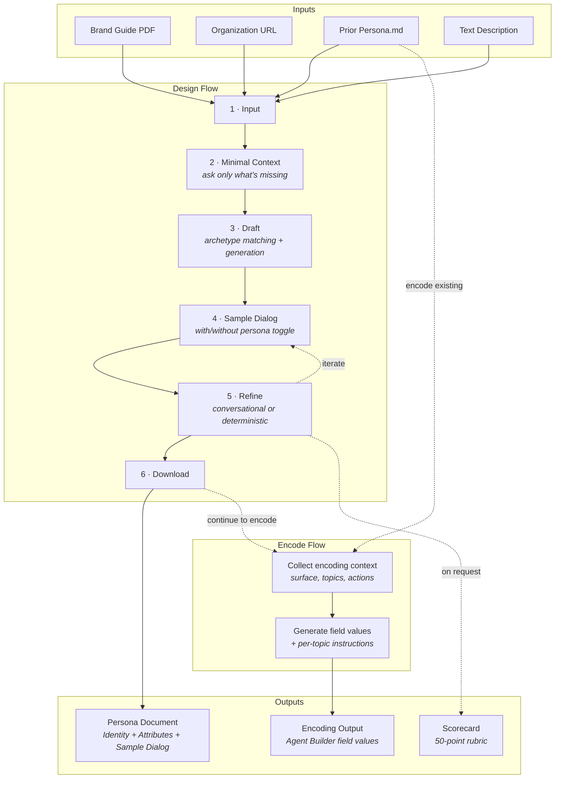

# Agent Persona Design Skill

Design AI agent personas for Salesforce Agentforce using the **Identity + 12 decomposed attributes** framework.

Users assign personality to conversational agents within seconds. If you don't design that personality intentionally, users will invent one — often inconsistent, often unflattering.

This skill provides a fast input-to-sample-dialog loop for designing consistent, intentional agent personas — from brand input through persona document to Agent Builder encoding.

## Quick Start

```
/sf-ai-agentforce-persona
```

Provide any starting input — a brand guide PDF, a URL, a prior persona document, or a text description — and the skill drafts a complete persona, shows you how the agent sounds in sample dialog, and lets you refine until it's right.

**Design flow:**

```
INPUT --> DRAFT --> SAMPLE DIALOG --> REFINE --> DOWNLOAD
```

1. **Input** — Brand guide PDF, URL, prior persona.md, or text description
2. **Minimal Context** — Only asks what the input doesn't already answer (zero questions is valid)
3. **Draft** — Auto-generates a complete persona via archetype matching (silent)
4. **Sample Dialog** — Shows how the agent sounds, with/without persona toggle
5. **Refine** — Conversational ("make it warmer") or deterministic (show all settings) editing
6. **Download** — Persona document with sample dialog included

**Encode flow** (separate entry point):
Provide an existing persona.md to generate Agent Builder field values, platform settings, per-topic instructions, and loading text.

## Output

Three Markdown files:
- **Persona document** (`_local/generated/[agent-name]-persona.md`) — design artifact defining who the agent is, how it sounds, what it never does, with sample dialog
- **Scorecard** (`_local/generated/[agent-name]-persona-scorecard.md`) — 50-point rubric evaluation (on request)
- **Encoding output** (`_local/generated/[agent-name]-persona-encoding.md`) — Agent Builder field values, platform settings, and reusable instruction blocks (via Encode flow)

## Files

| File | Purpose |
|---|---|
| `SKILL.md` | Skill definition — Design flow + Encode flow + scoring rubric |
| `references/persona-framework.md` | Identity + 5 categories, 12 attributes + persona archetype presets |
| `references/persona-encoding-guide.md` | How to encode persona into Agentforce Agent Builder |
| `assets/persona-template.md` | Persona document output template |
| `assets/persona-encoding-template.md` | Agent Builder encoding output template |

## Process Overview



## Framework Overview

12 attributes across 5 categories, each independently selectable:

- **Register** (1 attribute) — Subordinate / Peer / Advisor / Coach
- **Voice** (3 attributes)
  - **Formality** — Formal / Professional / Casual / Informal
  - **Warmth** — Cool / Neutral / Warm / Bright / Radiant
  - **Personality Intensity** — Reserved / Moderate / Distinctive / Bold
- **Tone** (2 attributes)
  - **Emotional Coloring** — Blunt / Clinical / Neutral / Encouraging / Enthusiastic
  - **Empathy Level** — Minimal / Understated / Moderate / High
  - *+ Tone Boundaries, Tone Flex*
- **Delivery** (2 attributes)
  - **Brevity** — Terse / Concise / Moderate / Expansive
  - **Humor** — None / Dry / Warm / Playful
- **Chatting Style** (4 attributes)
  - **Emoji** — None / Functional / Expressive
  - **Formatting** — Plain / Selective / Heavy
  - **Punctuation** — Conservative / Standard / Expressive
  - **Capitalization** — Standard / Casual

**Persona archetype presets** provide 6 starting points that pre-populate all 12 attributes:

| Use Case | Conservative | Outlandish |
|---|---|---|
| Internal Sales Coach | The Steady Hand | Drover |
| External Customer Service | The Concierge | Y.T. |
| Lead Generation | The Qualifier | Bluebonnet |

Attributes are ordered by dependency — upstream choices constrain downstream ones. The persona document also includes a **Phrase Book**, **Never-Say List**, **Tone Flex** rules, and optional **Lexicon** for per-topic vocabulary.

## Contributing Upstream

This skill is adapted from [cascadi/sf-ai-agentforce-persona](https://github.com/cascadi/sf-ai-agentforce-persona). See `CREDITS.md` for attribution.

## Acknowledgements

This framework synthesizes ideas from multiple published sources into an original persona design system for AI agents:

- **Conversation Design Institute (CDI)** — Foundational principles on why intentional persona design matters, including the pareidolia effect, register archetypes (via Leary's Interpersonal Circumplex), the "One Breath Test," tapering, and apology/acknowledgement guidelines
- **Nielsen Norman Group (NN/g)** — Research on voice and tone in UX writing, the distinction between voice (persistent) and tone (contextual), and usability heuristics that inform dimension boundaries
- **Google Conversation Design Guidelines** — Principles for persona definition, error handling patterns, and turn-taking in conversational interfaces
- **Amazon Alexa Design Guidelines** — Voice channel parameters (pitch, speaking rate, energy) and voice-specific persona considerations
- **Salesforce** — Agentforce platform architecture, Agent Builder field constraints, and Agentforce design patterns that shape the encoding guide

## License

MIT — see `LICENSE`.
