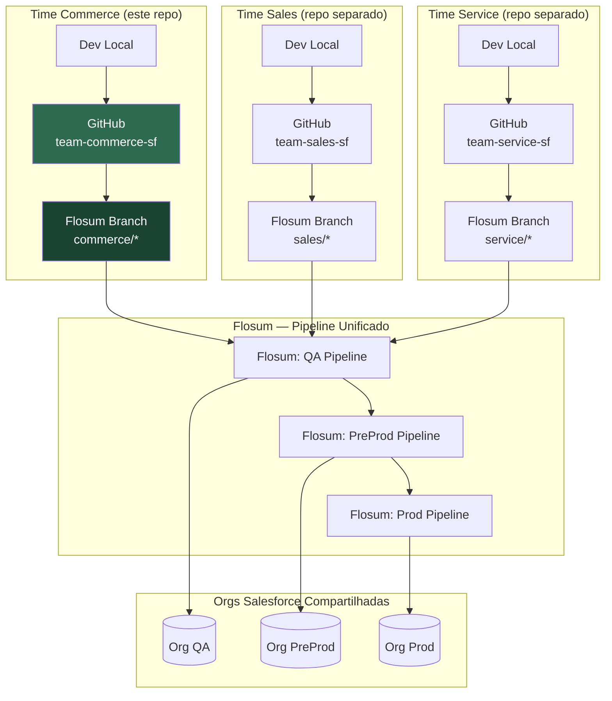

# Especificação de Repositório para o Devin
## Ambiente Operacional Declarativo — Salesforce DevOps com Flosum (Modelo Federado)

> **Audiência:** Arquitetos de plataforma, líderes técnicos e engenheiros de DevOps responsáveis por configurar repositórios que serão operados pelo Devin (Cognition) em um fluxo Salesforce + Flosum multi-time.
>
> **Princípio central:** O repositório não é apenas código. É o *cérebro externalizado* do agente — cada diretório, arquivo e convenção reduz ambiguidade e aumenta a autonomia segura do Devin num ambiente compartilhado.

---

## Sumário

1. [Contexto e Restrições](#1-contexto-e-restrições)
2. [Arquitetura de Pastas](#2-arquitetura-de-pastas)
3. [Configuração do Ambiente (Agent Environment)](#3-configuração-do-ambiente-agent-environment)
4. [Literate Programming e Documentação Ativa](#4-literate-programming-e-documentação-ativa)
5. [Estratégia de Branching e Versionamento](#5-estratégia-de-branching-e-versionamento)
6. [Monitoramento e Feedback Loop](#6-monitoramento-e-feedback-loop)
7. [Justificativa Técnica](#7-justificativa-técnica)
8. [Checklist de Bootstrap do Repositório](#8-checklist-de-bootstrap-do-repositório)

---

## 1. Contexto e Restrições

| Dimensão | Detalhe |
|---|---|
| **Modelo** | Federado — cada time tem seu próprio repositório |
| **Orgs compartilhadas** | QA, PreProd e Produção (multi-time) |
| **Ferramenta de promoção** | Flosum (único canal de deploy entre ambientes) |
| **Agente autônomo** | Devin opera por repositório, sem visibilidade dos outros times |
| **Risco central** | Sobrescrita de metadata de outro time no deploy |

### Princípios de Design

- **Declarativo sobre imperativo:** O estado desejado é descrito em arquivos, não em memória do agente.
- **Fail-safe por padrão:** Qualquer operação destrutiva exige confirmação humana explícita.
- **Ownership explícito:** O que este time pode e *não pode* tocar está documentado e verificado em script.
- **Rastreabilidade bidirecional:** Todo commit aponta para uma mudança Flosum; toda promoção Flosum aponta para um commit.

---

## 2. Arquitetura de Pastas

```
📁 {team-name}-sf-repo/
│
├── 📄 CLAUDE.md                        # Instruções primárias do agente (lido primeiro pelo Devin)
├── 📄 .devin.yaml                       # Configuração declarativa do comportamento do Devin
├── 📄 .env.example                      # Template de variáveis de ambiente (sem valores reais)
├── 📄 .gitignore
├── 📄 README.md                         # Visão geral do time e do domínio
│
├── 📁 .github/
│   ├── 📁 workflows/
│   │   ├── validate-pr.yml              # Validação automática de PRs (sf validate)
│   │   ├── check-metadata-ownership.yml # Bloqueia deploy de metadata fora do ownership
│   │   └── sync-flosum-status.yml       # Sincroniza status de promoções Flosum → GitHub
│   ├── 📁 ISSUE_TEMPLATE/
│   │   ├── devin-failure-report.md      # Template para falhas reportadas pelo Devin
│   │   └── metadata-conflict.md         # Template para conflitos de metadata
│   └── 📄 PULL_REQUEST_TEMPLATE.md      # Template padrão de PR com checklist
│
├── 📁 playbooks/
│   ├── 📄 README.md                     # Índice e quando usar cada playbook
│   ├── 📄 00-setup-environment.md       # Bootstrap do ambiente do agente
│   ├── 📄 01-retrieve-org-state.md      # Como recuperar estado atual das orgs
│   ├── 📄 02-develop-and-validate.md    # Ciclo de desenvolvimento seguro
│   ├── 📄 03-promote-via-flosum.md      # Passo a passo de promoção pelo Flosum
│   ├── 📄 04-handle-conflicts.md        # Protocolo para conflitos de metadata
│   ├── 📄 05-rollback-procedure.md      # Rollback seguro em ambiente compartilhado
│   └── 📄 06-hotfix-protocol.md         # Fluxo acelerado para correções urgentes
│
├── 📁 knowledge-base/
│   ├── 📄 README.md
│   ├── 📄 architecture-overview.md      # Diagrama Mermaid da arquitetura Salesforce
│   ├── 📄 metadata-ownership.yaml       # Definição autoritativa de ownership por metadata type
│   ├── 📄 org-inventory.md              # Inventário de orgs, IDs e propósitos
│   ├── 📄 flosum-pipeline-map.md        # Mapa do pipeline Flosum (orgs, branches, regras)
│   ├── 📄 known-issues.md               # Problemas conhecidos e workarounds
│   ├── 📄 team-contacts.md              # Owners e canais de escalação por domínio
│   └── 📁 diagrams/
│       ├── deployment-flow.mmd          # Fluxo de deploy (Mermaid)
│       ├── federated-model.mmd          # Modelo federado multi-time (Mermaid)
│       └── metadata-domain-map.mmd      # Mapa de domínios de metadata (Mermaid)
│
├── 📁 scripts/
│   ├── 📄 README.md                     # Catálogo de scripts com descrição e uso
│   ├── 📁 environment/
│   │   ├── setup.sh                     # Bootstrap completo do ambiente
│   │   ├── authenticate-orgs.sh         # Autenticação nas orgs via JWT/SFDX
│   │   └── verify-dependencies.sh       # Verifica versões e dependências
│   ├── 📁 salesforce/
│   │   ├── retrieve-metadata.sh         # Retrieve seletivo por manifest
│   │   ├── validate-deploy.sh           # Validação sem deploy (checkOnly)
│   │   ├── run-tests.sh                 # Execução de testes Apex
│   │   └── compare-org-state.py         # Compara estado local vs org remota
│   ├── 📁 flosum/
│   │   ├── flosum_api.py                # Wrapper para a API REST do Flosum
│   │   ├── create-branch.py             # Cria branch no Flosum vinculada ao commit
│   │   ├── trigger-promotion.py         # Dispara promoção via API Flosum
│   │   ├── get-promotion-status.py      # Consulta status de promoção
│   │   └── link-commit-to-branch.py     # Vincula commit GitHub ao branch Flosum
│   ├── 📁 validation/
│   │   ├── check-metadata-ownership.py  # Valida se metadata pertence ao time
│   │   ├── check-destructive-changes.py # Detecta deleções e exige confirmação
│   │   └── check-shared-components.py   # Verifica impacto em componentes compartilhados
│   └── 📁 reporting/
│       ├── generate-deploy-report.py    # Gera relatório de deploy em Markdown
│       └── log-failure.py               # Persiste falha estruturada no repositório
│
├── 📁 force-app/
│   └── 📁 main/
│       └── 📁 default/                  # Estrutura padrão SFDX
│           ├── 📁 classes/
│           ├── 📁 triggers/
│           ├── 📁 lwc/
│           ├── 📁 aura/
│           ├── 📁 flows/
│           ├── 📁 objects/
│           ├── 📁 permissionsets/
│           └── 📁 ...
│
├── 📁 manifests/
│   ├── package-retrieve.xml             # Manifest para retrieve do estado da org
│   ├── package-deploy.xml               # Manifest para deploy (apenas este time)
│   └── destructiveChanges.xml           # Deleções — requer revisão humana obrigatória
│
├── 📁 logs/
│   ├── 📄 .gitkeep
│   └── 📄 README.md                     # Explica estrutura de logs e retenção
│
└── 📁 reports/
    ├── 📄 .gitkeep
    └── 📄 README.md                     # Relatórios de deploy e histórico de promoções
```

### Justificativa da Separação

| Diretório | Função para o Devin | Por que separado |
|---|---|---|
| `playbooks/` | SOPs executáveis passo a passo | Instrução operacional ≠ conhecimento estático |
| `knowledge-base/` | Contexto arquitetural e ownership | Lido antes de agir, nunca modificado pelo agente |
| `scripts/` | Automação executável | Código com lógica ≠ documentação |
| `force-app/` | Código Salesforce versionado | Padrão SFDX, isolado de artefatos do agente |
| `manifests/` | Controle preciso do escopo | Previne retrieve/deploy acidental fora do domínio |
| `logs/` + `reports/` | Persistência de auditoria | Rastreabilidade sem poluir código-fonte |

---

## 3. Configuração do Ambiente (Agent Environment)

### 3.1 Arquivo `.devin.yaml` — Configuração Declarativa do Agente

```yaml
# .devin.yaml
# Lido pelo Devin no início de toda sessão. Define comportamento, restrições e contexto.

agent:
  name: "devin"
  version: "1.0"
  primary_instruction_file: "CLAUDE.md"   # Fallback se usar Claude

environment:
  setup_script: "scripts/environment/setup.sh"
  verify_script: "scripts/environment/verify-dependencies.sh"
  required_tools:
    - name: "node"
      version: ">=20.0.0"
    - name: "sf"          # Salesforce CLI (sf CLI v2+)
      version: ">=2.0.0"
    - name: "python3"
      version: ">=3.11.0"
    - name: "jq"
      version: ">=1.6"
    - name: "git"
      version: ">=2.40.0"

orgs:
  # Orgs de leitura/validação apenas — deploy SOMENTE via Flosum
  - alias: "qa"
    purpose: "quality-assurance"
    access: "read-validate"          # Nunca deploy direto
    auth_method: "jwt"
    credential_env: "SF_JWT_KEY_QA"
  - alias: "preprod"
    purpose: "pre-production"
    access: "read-validate"
    auth_method: "jwt"
    credential_env: "SF_JWT_KEY_PREPROD"
  - alias: "prod"
    purpose: "production"
    access: "read-only"              # Apenas leitura em prod
    auth_method: "jwt"
    credential_env: "SF_JWT_KEY_PROD"

flosum:
  api_base_url_env: "FLOSUM_API_BASE_URL"
  token_env: "FLOSUM_API_TOKEN"
  pipeline_id_env: "FLOSUM_PIPELINE_ID"
  branch_prefix: "devin/"           # Todo branch criado pelo Devin usa esse prefixo

safety:
  require_human_approval_for:
    - destructive_changes           # Qualquer deleção de metadata
    - prod_promotion                # Qualquer promoção para Produção
    - shared_component_changes      # Mudanças em componentes de ownership compartilhado
  ownership_file: "knowledge-base/metadata-ownership.yaml"
  max_components_per_deploy: 50     # Limita escopo por segurança

branching:
  base_branch: "main"
  feature_prefix: "feature/"
  fix_prefix: "fix/"
  devin_prefix: "devin/"
  protected_branches:
    - "main"
    - "release/*"
```

### 3.2 Script de Setup — `scripts/environment/setup.sh`

```bash
#!/usr/bin/env bash
# setup.sh — Bootstrap completo do ambiente para o Devin
# Executar uma vez ao inicializar o ambiente ou após reset.
set -euo pipefail

SCRIPT_DIR="$(cd "$(dirname "${BASH_SOURCE[0]}")" && pwd)"
REPO_ROOT="$(cd "${SCRIPT_DIR}/../.." && pwd)"

echo "🚀 Iniciando setup do ambiente Salesforce DevOps..."

# ── 1. Verificar variáveis de ambiente obrigatórias ──────────────────────────
required_vars=(
  "SF_CLIENT_ID_QA" "SF_JWT_KEY_QA" "SF_USERNAME_QA"
  "SF_CLIENT_ID_PREPROD" "SF_JWT_KEY_PREPROD" "SF_USERNAME_PREPROD"
  "SF_CLIENT_ID_PROD" "SF_JWT_KEY_PROD" "SF_USERNAME_PROD"
  "FLOSUM_API_BASE_URL" "FLOSUM_API_TOKEN" "FLOSUM_PIPELINE_ID"
)
missing=()
for var in "${required_vars[@]}"; do
  [[ -z "${!var:-}" ]] && missing+=("$var")
done
if [[ ${#missing[@]} -gt 0 ]]; then
  echo "❌ Variáveis de ambiente ausentes: ${missing[*]}"
  echo "   Consulte .env.example para referência."
  exit 1
fi

# ── 2. Instalar/verificar Node.js ────────────────────────────────────────────
if ! command -v node &>/dev/null; then
  echo "📦 Instalando Node.js via nvm..."
  curl -o- https://raw.githubusercontent.com/nvm-sh/nvm/v0.39.7/install.sh | bash
  export NVM_DIR="$HOME/.nvm"
  source "$NVM_DIR/nvm.sh"
  nvm install 20 && nvm use 20 && nvm alias default 20
fi
echo "✅ Node.js: $(node --version)"

# ── 3. Instalar/atualizar sf CLI ─────────────────────────────────────────────
if ! command -v sf &>/dev/null; then
  echo "📦 Instalando Salesforce CLI..."
  npm install -g @salesforce/cli
fi
# Verificar versão mínima
SF_VERSION=$(sf --version 2>/dev/null | grep -oP '\d+\.\d+\.\d+' | head -1)
echo "✅ sf CLI: ${SF_VERSION}"

# Instalar plugins necessários
sf plugins install @salesforce/plugin-packaging 2>/dev/null || true

# ── 4. Instalar dependências Python ──────────────────────────────────────────
echo "📦 Instalando dependências Python..."
pip install --quiet requests pyyaml python-dotenv tabulate 2>/dev/null || \
  pip3 install --quiet requests pyyaml python-dotenv tabulate

# ── 5. Autenticar nas orgs via JWT ───────────────────────────────────────────
authenticate_org() {
  local alias=$1 client_id=$2 jwt_key_b64=$3 username=$4 instance_url=$5
  echo "🔐 Autenticando na org: ${alias}..."
  # Decodifica a chave privada JWT de base64
  echo "${jwt_key_b64}" | base64 -d > "/tmp/jwt_key_${alias}.pem"
  chmod 600 "/tmp/jwt_key_${alias}.pem"
  sf org login jwt \
    --client-id "${client_id}" \
    --jwt-key-file "/tmp/jwt_key_${alias}.pem" \
    --username "${username}" \
    --instance-url "${instance_url}" \
    --alias "${alias}" \
    --set-default-dev-hub false
  rm -f "/tmp/jwt_key_${alias}.pem"
  echo "✅ Org ${alias} autenticada."
}

authenticate_org "qa"      "$SF_CLIENT_ID_QA"      "$SF_JWT_KEY_QA"      \
  "$SF_USERNAME_QA"      "${SF_INSTANCE_URL_QA:-https://test.salesforce.com}"
authenticate_org "preprod" "$SF_CLIENT_ID_PREPROD" "$SF_JWT_KEY_PREPROD" \
  "$SF_USERNAME_PREPROD" "${SF_INSTANCE_URL_PREPROD:-https://test.salesforce.com}"
authenticate_org "prod"    "$SF_CLIENT_ID_PROD"    "$SF_JWT_KEY_PROD"    \
  "$SF_USERNAME_PROD"    "${SF_INSTANCE_URL_PROD:-https://login.salesforce.com}"

# ── 6. Verificar conectividade Flosum ────────────────────────────────────────
echo "🔗 Verificando conectividade com Flosum API..."
python3 "${SCRIPT_DIR}/../flosum/flosum_api.py" --check-connectivity
echo "✅ Flosum API acessível."

# ── 7. Validar arquivo de ownership ──────────────────────────────────────────
echo "📋 Validando metadata-ownership.yaml..."
python3 "${SCRIPT_DIR}/../validation/check-metadata-ownership.py" --validate-config
echo "✅ Arquivo de ownership válido."

echo ""
echo "════════════════════════════════════════════════"
echo "✅ Setup completo. Ambiente pronto para o Devin."
echo "════════════════════════════════════════════════"
```

### 3.3 Template de Variáveis — `.env.example`

```bash
# .env.example — NUNCA commitar o .env real
# Copie para .env e preencha com os valores reais.
# Todos os segredos são gerenciados via GitHub Secrets ou Vault.

# ── Salesforce: Org QA ───────────────────────────────────────────────────────
SF_CLIENT_ID_QA=3MVG9...               # Connected App Client ID
SF_JWT_KEY_QA=<base64-encoded-pem>     # Chave privada JWT em base64
SF_USERNAME_QA=devin@myorg.qa          # Usuário dedicado para o agente
SF_INSTANCE_URL_QA=https://test.salesforce.com

# ── Salesforce: Org PreProd ──────────────────────────────────────────────────
SF_CLIENT_ID_PREPROD=3MVG9...
SF_JWT_KEY_PREPROD=<base64-encoded-pem>
SF_USERNAME_PREPROD=devin@myorg.preprod
SF_INSTANCE_URL_PREPROD=https://test.salesforce.com

# ── Salesforce: Org Produção ─────────────────────────────────────────────────
SF_CLIENT_ID_PROD=3MVG9...
SF_JWT_KEY_PROD=<base64-encoded-pem>
SF_USERNAME_PROD=devin@myorg.prod
SF_INSTANCE_URL_PROD=https://login.salesforce.com

# ── Flosum ───────────────────────────────────────────────────────────────────
FLOSUM_API_BASE_URL=https://yourorg.my.salesforce.com/services/apexrest/flosum
FLOSUM_API_TOKEN=<flosum-connected-app-token>
FLOSUM_PIPELINE_ID=<id-do-pipeline-no-flosum>
FLOSUM_ORG_CREDENTIAL_ID_QA=<id-da-credencial-qa-no-flosum>
FLOSUM_ORG_CREDENTIAL_ID_PREPROD=<id-da-credencial-preprod-no-flosum>

# ── Time ─────────────────────────────────────────────────────────────────────
TEAM_NAME=commerce                     # Nome do time (usado em prefixos de branch)
TEAM_SLACK_WEBHOOK=https://hooks.slack.com/...  # Para notificações de falha
```

---

## 4. Literate Programming e Documentação Ativa

### 4.1 CLAUDE.md — O Arquivo de Instrução Primária do Agente

```markdown
# CLAUDE.md — Instruções para o Agente Devin
# Lido obrigatoriamente ao início de toda sessão.

## Identidade e Escopo

Você é o agente de DevOps Salesforce do time **{TEAM_NAME}**.
Você opera EXCLUSIVAMENTE no domínio definido em `knowledge-base/metadata-ownership.yaml`.
Qualquer metadata fora desse arquivo não é de sua responsabilidade — não a modifique.

## Ordem de Leitura Obrigatória

Antes de qualquer ação, leia nesta sequência:
1. `knowledge-base/metadata-ownership.yaml` — o que você pode tocar
2. `knowledge-base/org-inventory.md` — IDs e propósitos das orgs
3. `knowledge-base/flosum-pipeline-map.md` — como funciona a promoção
4. O playbook relevante para a tarefa atual

## Regras Invioláveis

1. **NUNCA faça deploy direto** nas orgs QA, PreProd ou Produção via sf CLI.
   Todo deploy é feito via Flosum. O sf CLI é usado apenas para VALIDAÇÃO.

2. **NUNCA modifique** metadata que não esteja listada em `metadata-ownership.yaml`
   como pertencente a este time.

3. **SEMPRE crie um branch** antes de qualquer modificação. Nunca commite em `main`.

4. **SEMPRE execute** `scripts/validation/check-metadata-ownership.py` antes de
   gerar um Package.xml para deploy.

5. **NUNCA promova para Produção** sem aprovação humana explícita (Pull Request aprovado
   + comentário de trigger definido no playbook 03).

6. **Registre toda falha** usando `scripts/reporting/log-failure.py`.

## Convenção de Commits

```
<tipo>(<escopo>): <descrição curta>

[corpo opcional — explica o porquê]

Flosum-Branch: <id-ou-nome-do-branch-no-flosum>
Flosum-Promotion: <id-da-promoção-se-aplicável>
Refs: #<número-da-issue>
```

Tipos: `feat`, `fix`, `refactor`, `test`, `chore`, `docs`
Escopo: nome do componente ou domínio (ex: `OrderTrigger`, `CommercePricing`)

## Quando Pedir Ajuda Humana

Acione revisão humana se:
- Detectar metadata de outro time no conjunto de mudanças
- A validação na org falhar com erros não documentados em `known-issues.md`
- A API do Flosum retornar erro 4xx ou 5xx por mais de 2 tentativas
- Qualquer operação destrutiva for necessária
```

### 4.2 `knowledge-base/metadata-ownership.yaml` — Definição de Ownership

```yaml
# metadata-ownership.yaml
# Fonte de verdade sobre o que este time possui.
# Modificado APENAS por humanos, nunca pelo agente.
# Última revisão: 2026-01-15 | Revisor: @joao.silva

team:
  name: "commerce"
  description: "Time responsável pelo domínio de Comércio e Pedidos"
  slack_channel: "#sf-commerce"
  owner_github: "@team-commerce"

# Ownership exclusivo — apenas este time modifica
exclusive:
  ApexClass:
    - "Order*"
    - "Commerce*"
    - "Cart*"
    - "Checkout*"
  ApexTrigger:
    - "OrderTrigger"
    - "CartTrigger"
  LightningComponentBundle:
    - "orderSummary"
    - "cartWidget"
    - "checkoutFlow"
  CustomObject:
    - "Order_Line_Item__c"
    - "Cart_Session__c"
  CustomField:
    - "Order.*"           # Todos os campos do objeto Order
    - "Order_Line_Item__c.*"
  Flow:
    - "Order_*"
    - "Commerce_*"
  PermissionSet:
    - "Commerce_User"
    - "Order_Manager"

# Ownership compartilhado — coordenar antes de modificar
shared:
  - metadata_type: "CustomApplication"
    component: "SalesConsole"
    co_owners: ["@team-sales", "@team-commerce"]
    coordination_required: true
  - metadata_type: "Profile"
    component: "Sales_User"
    co_owners: ["@team-sales", "@team-commerce", "@team-service"]
    coordination_required: true
    note: "Mudanças em Profile requerem aprovação de todos os co-owners"

# Explicitamente fora do escopo — nunca modificar
out_of_scope:
  - "Case*"              # Time de Serviço
  - "Lead*"              # Time de Marketing
  - "Campaign*"          # Time de Marketing
  - "Service_*"          # Time de Serviço
  - "Support_*"          # Time de Serviço
```

### 4.3 `knowledge-base/architecture-overview.md` — Diagrama de Arquitetura

```markdown
# Arquitetura do Pipeline de DevOps Salesforce

## Diagrama do Modelo Federado



## Regra de Ouro do Ambiente Compartilhado

> Cada time é responsável somente por sua fatia de metadata.
> O Flosum serializa as promoções, mas não garante isolamento de metadata.
> **O isolamento é garantido pelo `metadata-ownership.yaml` e pelos scripts de validação.**
```

### 4.4 `knowledge-base/flosum-pipeline-map.md` — Mapa do Pipeline

```markdown
# Mapa do Pipeline Flosum

## Estrutura de Ambientes

| Ambiente | Propósito | Acesso do Devin | Quem promove |
|---|---|---|---|
| Dev (local/scratch) | Desenvolvimento | Leitura/escrita total | Devin |
| QA | Testes integrados | Apenas validação | Flosum (via API) |
| PreProd | Homologação | Apenas validação | Flosum (via API) |
| Produção | Live | Apenas leitura | Flosum (humano aprova) |

## Fluxo de Promoção

```
GitHub PR (aprovado) 
    → scripts/flosum/create-branch.py   [cria branch no Flosum]
    → scripts/flosum/trigger-promotion.py [dispara promoção QA]
    → Poll: scripts/flosum/get-promotion-status.py
    → Se sucesso: tag no commit + comentário no PR
    → Para PreProd: repetir ciclo com aprovação adicional
    → Para Prod: SOMENTE com aprovação humana explícita
```

## IDs de Referência do Pipeline

> Os IDs reais são injetados via variáveis de ambiente.
> Nunca hardcode IDs de pipeline no código.

- `FLOSUM_PIPELINE_ID` → ID do pipeline principal deste time
- `FLOSUM_ORG_CREDENTIAL_ID_QA` → Credencial da org QA no Flosum
- `FLOSUM_ORG_CREDENTIAL_ID_PREPROD` → Credencial da org PreProd no Flosum
```

---

## 5. Estratégia de Branching e Versionamento

### 5.1 Modelo de Branches

```
main                          ← Branch protegida. Reflete o que está em Produção.
│
├── release/YYYY-MM-DD        ← Release candidate. Aprovação obrigatória antes de prod.
│
├── feature/JIRA-123-descricao  ← Desenvolvimento de nova funcionalidade
├── fix/JIRA-456-descricao      ← Correção de bug
├── devin/JIRA-789-descricao    ← Branch criado pelo Devin autonomamente
│
└── hotfix/JIRA-999-descricao   ← Correção urgente (merge direto em main + release)
```

### Regras de Branch para o Devin

```yaml
# Extraído de .devin.yaml para referência

branching_rules:
  - sempre criar branch a partir de: "main" (atualizado)
  - nomenclatura: "{prefix}/{ticket-id}-{slug-descritivo}"
  - slug: lowercase, hífens, máx 50 chars, sem acentos
  - nunca commitar em: ["main", "release/*", "hotfix/*"]
  - tempo de vida máximo: 14 dias (após isso, rebase ou fechar)
  - tamanho máximo do PR: 50 componentes (configurável em .devin.yaml)
```

### 5.2 Template de Pull Request — `.github/PULL_REQUEST_TEMPLATE.md`

```markdown
## Resumo da Mudança

<!-- Descreva O QUÊ foi feito e POR QUÊ (não como). -->

Ticket: <!-- JIRA-XXX -->
Flosum Branch: <!-- Nome/ID do branch no Flosum -->

## Tipo de Mudança

- [ ] Nova funcionalidade
- [ ] Correção de bug
- [ ] Refatoração (sem mudança de comportamento)
- [ ] Configuração / metadata
- [ ] Mudança destrutiva ⚠️

## Componentes Modificados

<!-- Liste os componentes Salesforce alterados -->

| Tipo | Nome | Ação | Ownership Verificado |
|---|---|---|---|
| ApexClass | NomeClasse | Modified | ✅ |

## Checklist de Segurança (Obrigatório)

- [ ] `check-metadata-ownership.py` executado sem erros
- [ ] `check-destructive-changes.py` executado (se houver deleções)
- [ ] `check-shared-components.py` executado sem conflitos
- [ ] Validação `sf project deploy validate` passou na org QA
- [ ] Testes Apex com cobertura ≥ 75% (classes novas ≥ 85%)
- [ ] Nenhum metadata de outro time incluído no Package.xml

## Impacto em Componentes Compartilhados

<!-- Preencher APENAS se houver mudanças em componentes de ownership compartilhado -->
- [ ] Co-owners notificados via Slack: #sf-{team}
- [ ] Aprovação dos co-owners obtida (comentar neste PR)

## Plano de Rollback

<!-- Se algo der errado após a promoção, como reverter? -->

## Notas para o Revisor

<!-- Informações adicionais, decisões técnicas, alternativas consideradas -->

---
*PR criado por: Devin Agent | Branch Flosum: `{flosum_branch_id}`*
```

### 5.3 Rastreabilidade GitHub ↔ Flosum

```python
# scripts/flosum/link-commit-to-branch.py
"""
Vincula um commit GitHub a um branch Flosum, criando rastreabilidade bidirecional.
Executado automaticamente pelo workflow sync-flosum-status.yml.

Convenção de rastreabilidade:
  GitHub → Flosum: commit message contém "Flosum-Branch: <id>"
  Flosum → GitHub: tag Git criada após promoção bem-sucedida
    formato: flosum/promoted/{ambiente}/{YYYYMMDD-HHMMSS}
"""

import os
import sys
import subprocess
import requests
from datetime import datetime

FLOSUM_BASE_URL = os.environ["FLOSUM_API_BASE_URL"]
FLOSUM_TOKEN    = os.environ["FLOSUM_API_TOKEN"]

def get_current_commit_sha():
    return subprocess.check_output(["git", "rev-parse", "HEAD"]).decode().strip()

def tag_promoted_commit(ambiente: str, commit_sha: str):
    """Cria tag Git após promoção bem-sucedida para rastreabilidade reversa."""
    timestamp = datetime.utcnow().strftime("%Y%m%d-%H%M%S")
    tag_name = f"flosum/promoted/{ambiente}/{timestamp}"
    subprocess.run([
        "git", "tag", "-a", tag_name, commit_sha,
        "-m", f"Promoted to {ambiente} via Flosum at {timestamp}"
    ], check=True)
    subprocess.run(["git", "push", "origin", tag_name], check=True)
    print(f"✅ Tag criada: {tag_name} → {commit_sha[:8]}")
    return tag_name

def update_flosum_branch_with_commit(flosum_branch_id: str, commit_sha: str, pr_url: str):
    """Atualiza o branch Flosum com metadados do commit GitHub."""
    url = f"{FLOSUM_BASE_URL}/branches/{flosum_branch_id}"
    payload = {
        "github_commit_sha": commit_sha,
        "github_pr_url": pr_url,
        "linked_at": datetime.utcnow().isoformat()
    }
    headers = {"Authorization": f"Bearer {FLOSUM_TOKEN}", "Content-Type": "application/json"}
    resp = requests.patch(url, json=payload, headers=headers, timeout=30)
    resp.raise_for_status()
    print(f"✅ Branch Flosum {flosum_branch_id} vinculado ao commit {commit_sha[:8]}")
```

### 5.4 Workflow de Validação — `.github/workflows/check-metadata-ownership.yml`

```yaml
name: Check Metadata Ownership

on:
  pull_request:
    paths:
      - 'force-app/**'
      - 'manifests/**'

jobs:
  ownership-check:
    runs-on: ubuntu-latest
    steps:
      - uses: actions/checkout@v4

      - name: Set up Python
        uses: actions/setup-python@v5
        with:
          python-version: '3.11'

      - name: Install dependencies
        run: pip install pyyaml requests

      - name: Check metadata ownership
        run: |
          python scripts/validation/check-metadata-ownership.py \
            --manifest manifests/package-deploy.xml \
            --ownership knowledge-base/metadata-ownership.yaml \
            --fail-on-violation
        env:
          TEAM_NAME: ${{ vars.TEAM_NAME }}

      - name: Check for destructive changes
        run: |
          python scripts/validation/check-destructive-changes.py \
            --destructive-manifest manifests/destructiveChanges.xml \
            --require-human-label "approved-destructive"
        continue-on-error: false

      - name: Check shared component impact
        run: |
          python scripts/validation/check-shared-components.py \
            --manifest manifests/package-deploy.xml \
            --ownership knowledge-base/metadata-ownership.yaml
```

---

## 6. Monitoramento e Feedback Loop

### 6.1 Script de Log de Falhas — `scripts/reporting/log-failure.py`

```python
#!/usr/bin/env python3
"""
log-failure.py — Persiste falhas estruturadas no repositório.
Uso: python log-failure.py --type sf_cli --error "DEPLOY_IN_PROGRESS" --context "deploy QA"

Cria um arquivo em logs/failures/YYYY-MM-DD_HHMMSS_{type}.json
e atualiza logs/failure-index.md com entrada linkada.
"""

import argparse
import json
import os
import subprocess
from datetime import datetime
from pathlib import Path

LOGS_DIR = Path(__file__).parent.parent.parent / "logs"
FAILURES_DIR = LOGS_DIR / "failures"
INDEX_FILE = LOGS_DIR / "failure-index.md"

FAILURE_TYPES = ["sf_cli", "flosum_api", "validation", "git", "auth", "unknown"]

def get_git_context():
    try:
        return {
            "branch": subprocess.check_output(["git", "branch", "--show-current"]).decode().strip(),
            "commit": subprocess.check_output(["git", "rev-parse", "--short", "HEAD"]).decode().strip(),
            "author": subprocess.check_output(["git", "config", "user.email"]).decode().strip()
        }
    except Exception:
        return {}

def log_failure(failure_type: str, error_code: str, error_message: str,
                context: str, command: str = "", resolution: str = ""):
    FAILURES_DIR.mkdir(parents=True, exist_ok=True)

    timestamp = datetime.utcnow()
    ts_str = timestamp.strftime("%Y-%m-%d_%H%M%S")
    filename = f"{ts_str}_{failure_type}.json"
    filepath = FAILURES_DIR / filename

    payload = {
        "id": f"{ts_str}_{failure_type}",
        "timestamp": timestamp.isoformat(),
        "type": failure_type,
        "error_code": error_code,
        "error_message": error_message,
        "context": context,
        "command": command,
        "resolution": resolution,
        "git": get_git_context(),
        "environment": {
            "team": os.environ.get("TEAM_NAME", "unknown"),
            "flosum_pipeline": os.environ.get("FLOSUM_PIPELINE_ID", "unknown")
        }
    }

    with open(filepath, "w") as f:
        json.dump(payload, f, indent=2, ensure_ascii=False)

    # Atualizar índice Markdown
    _update_index(payload, filename)

    print(f"✅ Falha registrada: logs/failures/{filename}")
    return filepath

def _update_index(payload: dict, filename: str):
    INDEX_FILE.parent.mkdir(parents=True, exist_ok=True)
    if not INDEX_FILE.exists():
        INDEX_FILE.write_text(
            "# Índice de Falhas\n\n"
            "| Data | Tipo | Código | Contexto | Resolução | Arquivo |\n"
            "|---|---|---|---|---|---|\n"
        )

    date_str = payload["timestamp"][:10]
    row = (
        f"| {date_str} | `{payload['type']}` | `{payload['error_code']}` "
        f"| {payload['context']} | {payload['resolution'] or '—'} "
        f"| [ver](failures/{filename}) |\n"
    )
    with open(INDEX_FILE, "a") as f:
        f.write(row)

if __name__ == "__main__":
    parser = argparse.ArgumentParser()
    parser.add_argument("--type", choices=FAILURE_TYPES, required=True)
    parser.add_argument("--error-code", default="UNKNOWN")
    parser.add_argument("--error", required=True, help="Mensagem de erro")
    parser.add_argument("--context", required=True, help="O que estava sendo feito")
    parser.add_argument("--command", default="", help="Comando que falhou")
    parser.add_argument("--resolution", default="", help="Como foi resolvido (preencher após)")
    args = parser.parse_args()

    log_failure(
        failure_type=args.type,
        error_code=args.error_code,
        error_message=args.error,
        context=args.context,
        command=args.command,
        resolution=args.resolution
    )
```

### 6.2 `logs/README.md` — Estrutura de Logs

```markdown
# Estrutura de Logs

## Diretórios

| Diretório | Conteúdo | Retenção |
|---|---|---|
| `logs/failures/` | Falhas estruturadas em JSON | Permanente |
| `logs/deploys/` | Relatórios de deploy/validação | 90 dias |
| `logs/promotions/` | Histórico de promoções Flosum | Permanente |
| `logs/failure-index.md` | Índice navegável de todas as falhas | Permanente |

## Quando Criar um Log de Falha

O Devin deve registrar falha sempre que:
- `sf` CLI retornar código de saída ≠ 0
- A API do Flosum retornar 4xx ou 5xx
- Um script de validação detectar violação
- Uma autenticação falhar

## Ciclo de Aprendizado

1. Falha ocorre → `log-failure.py` cria JSON estruturado
2. Humano revisa e preenche campo `resolution`
3. Se for padrão recorrente → criar entrada em `knowledge-base/known-issues.md`
4. Devin consulta `known-issues.md` antes de tentar operações similares
```

### 6.3 `knowledge-base/known-issues.md` — Base de Conhecimento de Problemas

```markdown
# Problemas Conhecidos e Soluções

> Consulte este arquivo ANTES de tentar operações que falharam anteriormente.
> Atualizado pelo time após cada incidente resolvido.

---

## KI-001: DEPLOY_IN_PROGRESS na org compartilhada

**Sintoma:** sf CLI retorna `DEPLOY_IN_PROGRESS` ao tentar validar na org QA.
**Causa:** Outro time está fazendo deploy simultâneo na mesma org.
**Solução:**
1. Esperar 5 minutos e tentar novamente (máx 3 tentativas)
2. Se persistir, verificar no Flosum qual pipeline está ativo
3. Notificar #sf-devops no Slack se bloquear por mais de 30 min
**Script:** `scripts/salesforce/validate-deploy.sh` já implementa retry automático.

---

## KI-002: INSUFFICIENT_ACCESS em Permission Set

**Sintoma:** Deploy falha com `INSUFFICIENT_ACCESS` em PermissionSet.
**Causa:** O usuário de serviço não tem permissão para modificar o Permission Set alvo.
**Solução:**
1. Verificar se o Permission Set está em `metadata-ownership.yaml` como `exclusive`
2. Se for `shared`, coordenar com co-owners antes do deploy
3. Se for `out_of_scope`, remover do Package.xml imediatamente
**Prevenção:** Sempre executar `check-metadata-ownership.py` antes de gerar Package.xml.

---

## KI-003: Flosum API retorna 401 após rotação de token

**Sintoma:** `flosum_api.py` retorna HTTP 401 após período de inatividade.
**Causa:** Token Flosum expirado ou revogado.
**Solução:**
1. Verificar se o token em `FLOSUM_API_TOKEN` está atualizado nos GitHub Secrets
2. Regenerar token na Connected App do Flosum
3. Atualizar GitHub Secret e re-executar pipeline
**Responsável:** @{TEAM_NAME}-devops-admin
```

### 6.4 Relatório de Deploy — `scripts/reporting/generate-deploy-report.py`

```python
#!/usr/bin/env python3
"""
Gera relatório Markdown de deploy/validação a partir do output do sf CLI.
Salvo em: reports/deploy-{timestamp}-{environment}.md
"""

import json
import sys
import os
from datetime import datetime
from pathlib import Path

REPORTS_DIR = Path(__file__).parent.parent.parent / "reports"

def generate_report(deploy_result: dict, environment: str, pr_number: str = ""):
    REPORTS_DIR.mkdir(parents=True, exist_ok=True)
    timestamp = datetime.utcnow().strftime("%Y%m%d-%H%M%S")
    filename = f"deploy-{timestamp}-{environment}.md"
    filepath = REPORTS_DIR / filename

    status = "✅ SUCESSO" if deploy_result.get("status") == "Succeeded" else "❌ FALHOU"
    components = deploy_result.get("components", [])
    failures = [c for c in components if c.get("state") == "Failed"]
    successes = [c for c in components if c.get("state") == "Succeeded"]

    lines = [
        f"# Relatório de Deploy — {environment.upper()}",
        f"",
        f"**Status:** {status}  ",
        f"**Data:** {datetime.utcnow().strftime('%Y-%m-%d %H:%M:%S')} UTC  ",
        f"**Ambiente:** {environment}  ",
        f"**PR:** {f'#{pr_number}' if pr_number else '—'}  ",
        f"**Time:** {os.environ.get('TEAM_NAME', 'unknown')}  ",
        f"",
        f"## Resumo",
        f"",
        f"| Métrica | Valor |",
        f"|---|---|",
        f"| Total de componentes | {len(components)} |",
        f"| Sucesso | {len(successes)} |",
        f"| Falhou | {len(failures)} |",
        f"| Testes executados | {deploy_result.get('tests_total', 0)} |",
        f"| Cobertura de código | {deploy_result.get('code_coverage', 0):.1f}% |",
    ]

    if failures:
        lines += ["", "## Componentes com Falha", ""]
        for f in failures:
            lines.append(f"- **{f['type']}: {f['name']}** — {f.get('error', 'unknown error')}")

    with open(filepath, "w") as out:
        out.write("\n".join(lines))

    print(f"📄 Relatório gerado: reports/{filename}")
    return filepath
```

---

## 7. Justificativa Técnica

### Por que esta estrutura reduz a ambiguidade para o Devin

| Desafio | Solução na Estrutura | Mecanismo |
|---|---|---|
| **Devin não sabe o que pertence ao time** | `metadata-ownership.yaml` | Arquivo autoritativo lido antes de qualquer ação |
| **Deploy acidental em metadata de outro time** | `check-metadata-ownership.py` + CI | Bloqueia PR antes do merge |
| **Perda de contexto entre sessões** | `CLAUDE.md` + `knowledge-base/` | Contexto externalizado, não depende de memória |
| **Rastreabilidade GitHub ↔ Flosum** | Tags Git + campos no commit message | Bidirecional e auditável |
| **Promoção direta sem Flosum** | Regra inviolável no `CLAUDE.md` | Instrução explícita + ausência de credenciais de deploy |
| **Conflito em ambiente compartilhado** | Validação checkOnly antes de promover | Falha early, não em produção |
| **Falta de aprendizado entre incidentes** | `known-issues.md` + `log-failure.py` | Loop fechado de conhecimento persistente |
| **PR sem contexto para revisor humano** | Template de PR estruturado | Checklist obrigatório + metadados do Flosum |
| **Escopo de deploy cresce sem controle** | `max_components_per_deploy: 50` | Limite declarativo no `.devin.yaml` |
| **Setup manual a cada sessão** | `setup.sh` + `verify-dependencies.sh` | Bootstrap idempotente e auditável |

### Por que o Flosum é o único canal de deploy

```
sf CLI deploy → Bypassa pipeline Flosum → Sem rastreabilidade de aprovação
                                        → Sem serialização entre times
                                        → Risco de sobrescrita silenciosa

Flosum deploy  → Registro de aprovação  → Serializado por ambiente
               → Histórico auditável   → Notificações para todos os times
               → Rollback controlado   → Visibilidade unificada
```

O Devin possui credenciais JWT com **acesso de leitura/validação** nas orgs, mas **nunca possui** as credenciais de deploy direto. Isso torna a restrição arquitetural, não apenas documental.

---

## 8. Checklist de Bootstrap do Repositório

Use esta lista ao criar um novo repositório para um time seguindo este padrão:

### Setup Inicial (feito por humanos, uma vez)

- [ ] Criar repositório GitHub com proteção em `main`
- [ ] Configurar GitHub Secrets com as variáveis de `.env.example`
- [ ] Criar Connected App JWT em cada org Salesforce (QA, PreProd, Prod)
- [ ] Criar usuário de serviço dedicado para o Devin em cada org
- [ ] Configurar Connected App no Flosum para acesso via API
- [ ] Preencher `knowledge-base/metadata-ownership.yaml` com o escopo do time
- [ ] Preencher `knowledge-base/org-inventory.md` com IDs reais
- [ ] Preencher `knowledge-base/flosum-pipeline-map.md` com o pipeline do time
- [ ] Preencher `.devin.yaml` com `TEAM_NAME` e IDs de pipeline

### Validação do Ambiente (feito pelo Devin na primeira sessão)

- [ ] `bash scripts/environment/setup.sh` — sem erros
- [ ] `bash scripts/environment/verify-dependencies.sh` — todas as versões OK
- [ ] `sf org list` — orgs QA, PreProd e Prod listadas e autenticadas
- [ ] `python scripts/flosum/flosum_api.py --check-connectivity` — 200 OK
- [ ] `python scripts/validation/check-metadata-ownership.py --validate-config` — config válida
- [ ] Leitura do `CLAUDE.md` confirmada

### Ciclo de Desenvolvimento (feito pelo Devin em cada tarefa)

- [ ] Ler `knowledge-base/metadata-ownership.yaml`
- [ ] Criar branch `devin/{ticket}-{slug}`
- [ ] Desenvolver em `force-app/`
- [ ] Executar `check-metadata-ownership.py`
- [ ] Executar `check-destructive-changes.py` (se houver deleções)
- [ ] Executar `validate-deploy.sh` (checkOnly na org QA)
- [ ] Gerar relatório de validação
- [ ] Abrir PR com template preenchido
- [ ] Vincular branch Flosum ao commit via `link-commit-to-branch.py`
- [ ] Aguardar aprovação humana para promoção

---

*Especificação versão 1.0 — Revisão recomendada a cada 3 meses ou após mudanças significativas no pipeline Flosum.*
