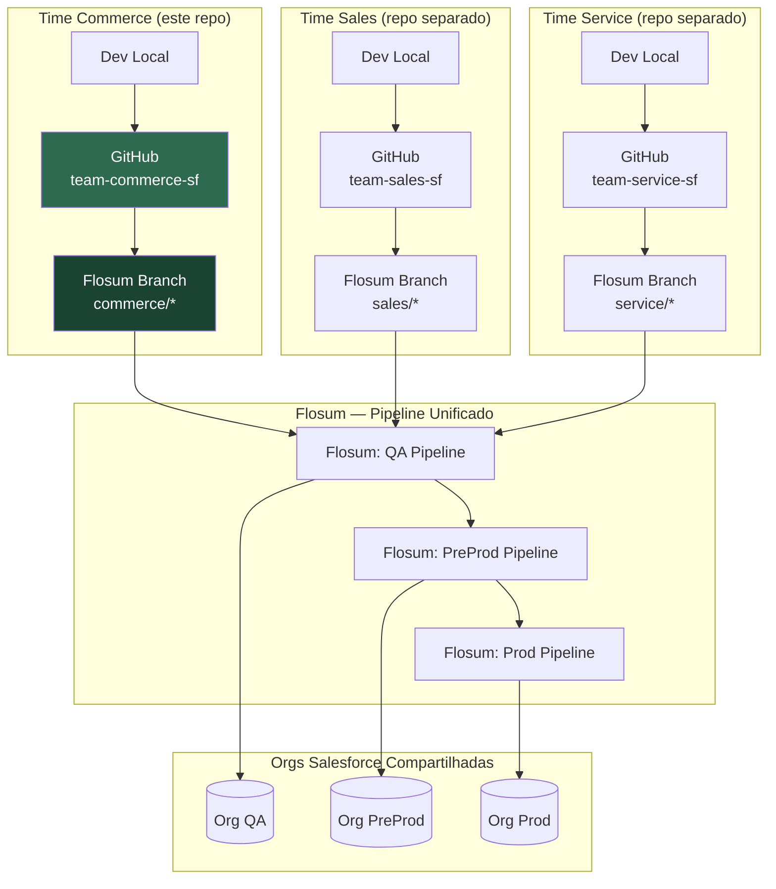

# Arquitetura do Pipeline de DevOps Salesforce

## Diagrama do Modelo Federado



## Regra de Ouro do Ambiente Compartilhado

> Cada time é responsável somente por sua fatia de metadata.
> O Flosum serializa as promoções, mas não garante isolamento de metadata.
> **O isolamento é garantido pelo `metadata-ownership.yaml` e pelos scripts de validação.**

## Acesso por Ambiente

| Ambiente | Acesso do Devin | Deploy via |
|---|---|---|
| Dev/Scratch | Leitura + escrita total | sf CLI direto |
| QA | Apenas validação (checkOnly) | Flosum |
| PreProd | Apenas validação (checkOnly) | Flosum |
| Produção | Apenas leitura | Flosum (humano aprova) |

## Por que o Flosum é o único canal de deploy

```
sf CLI deploy → Bypassa pipeline Flosum → Sem rastreabilidade de aprovação
                                        → Sem serialização entre times
                                        → Risco de sobrescrita silenciosa

Flosum deploy  → Registro de aprovação  → Serializado por ambiente
               → Histórico auditável   → Notificações para todos os times
               → Rollback controlado   → Visibilidade unificada
```

O Devin possui credenciais JWT com **acesso de leitura/validação** nas orgs,
mas **nunca possui** as credenciais de deploy direto.
Isso torna a restrição arquitetural, não apenas documental.
